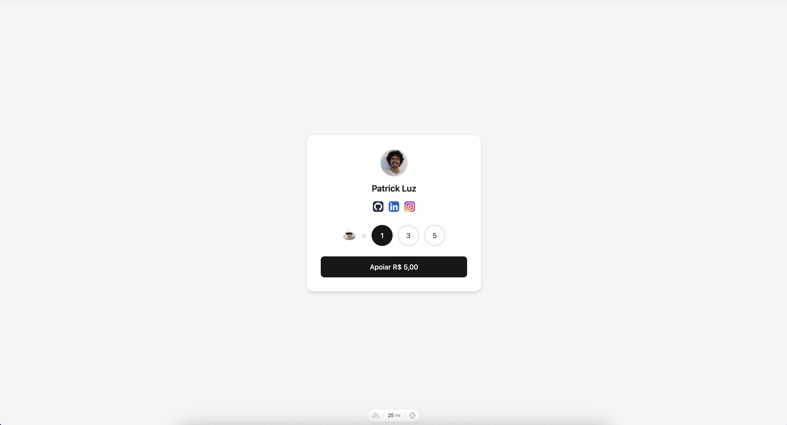
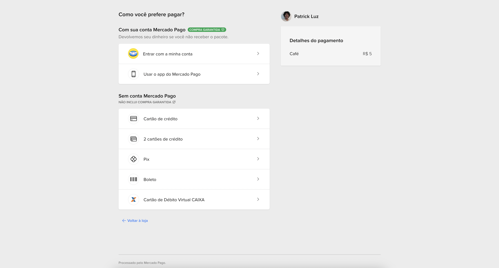

# Buy Me a Coffee - Mercado Pago Checkout PRO

Projeto desenvolvido para testar a integração com o **Mercado Pago Checkout PRO**. Inspirado no conceito "Buy Me a Coffee", permite que usuários selecionem a quantidade de cafés que desejam "comprar" e sejam redirecionados para o checkout seguro do Mercado Pago.

## Sobre o Projeto

Este é um projeto de demonstração construído com Nuxt 4 que implementa o fluxo completo de pagamento usando o Checkout PRO do Mercado Pago. O usuário pode escolher quantos cafés deseja comprar, e ao confirmar, é redirecionado para a página de pagamento oficial do Mercado Pago.

### Funcionalidades

- ☕ Seleção de quantidade de cafés
- 💳 Integração com Mercado Pago Checkout PRO
- ✅ Páginas de retorno (sucesso, pendente, falha)
- 🎨 Interface moderna com Tailwind CSS 4
- 🚀 Desenvolvido com Nuxt 4
- 🔒 Processamento seguro de pagamentos via Mercado Pago

## Tecnologias Utilizadas

- [Nuxt 4](https://nuxt.com/) - Framework Vue.js
- [Vue 3](https://vuejs.org/) - Framework JavaScript
- [Tailwind CSS 4](https://tailwindcss.com/) - Framework CSS
- [Mercado Pago SDK](https://www.mercadopago.com.br/developers) - SDK oficial do Mercado Pago
- [TypeScript](https://www.typescriptlang.org/) - Tipagem estática
- [Zod](https://zod.dev/) - Validação de schemas

## Pré-requisitos

Antes de começar, você precisa ter instalado:

- Node.js (versão 18 ou superior)
- npm, pnpm, yarn ou bun
- Conta no [Mercado Pago](https://www.mercadopago.com.br/) com credenciais de acesso

## Configuração

### 1. Obter Credenciais do Mercado Pago

1. Acesse o [Painel de Desenvolvedores do Mercado Pago](https://www.mercadopago.com.br/developers/panel)
2. Crie uma aplicação ou use uma existente
3. Copie o **Access Token** e a **Public Key**

### 2. Variáveis de Ambiente

Crie um arquivo `.env` na raiz do projeto baseando-se no `.env.example`:

```bash
cp .env.example .env
```

Edite o arquivo `.env` com suas informações:

```env
# URL base da aplicação
NUXT_PUBLIC_BASE_URL="http://localhost:3000"

# Informações do perfil
NUXT_PUBLIC_PROFILE_NAME="Seu Nome"
NUXT_PUBLIC_GITHUB_URL="https://github.com/seu-usuario"
NUXT_PUBLIC_LINKEDIN_URL="https://linkedin.com/in/seu-usuario"
NUXT_PUBLIC_INSTAGRAM_URL="https://instagram.com/seu-usuario"

# Preço unitário do café (em reais)
NUXT_PUBLIC_COFFEE_PRICE="5"

# Credenciais do Mercado Pago
MERCADOPAGO_ACCESS_TOKEN="your_mercadopago_access_token_here"
NUXT_PUBLIC_MERCADOPAGO_PUBLIC_KEY="your_mercadopago_public_key_here"
```

## Instalação

Instale as dependências do projeto:

```bash
# npm
npm install

# pnpm
pnpm install

# yarn
yarn install

# bun
bun install
```

## Executando o Projeto

### Modo Desenvolvimento

Inicie o servidor de desenvolvimento em `http://localhost:3000`:

```bash
# npm
npm run dev

# pnpm
pnpm dev

# yarn
yarn dev

# bun
bun run dev
```

### Modo Produção

Build da aplicação para produção:

```bash
# npm
npm run build

# pnpm
pnpm build

# yarn
yarn build

# bun
bun run build
```

Preview da build de produção:

```bash
# npm
npm run preview

# pnpm
pnpm preview

# yarn
yarn preview

# bun
bun run preview
```

## Como Usar

1. Acesse `http://localhost:3000`
2. Selecione a quantidade de cafés desejada
3. Clique no botão de pagamento
4. Você será redirecionado para o Checkout PRO do Mercado Pago
5. Complete o pagamento (em modo de teste, use os [cartões de teste](https://www.mercadopago.com.br/developers/pt/docs/checkout-pro/additional-content/test-cards))
6. Após o pagamento, você será redirecionado de volta para uma página de status:
   - `/success` - Pagamento aprovado
   - `/pending` - Pagamento pendente
   - `/failure` - Pagamento recusado

## Screenshots

### Tela Principal


### Checkout Mercado Pago


### Página de Sucesso


> **Nota:** Adicione as imagens na pasta `/screenshots` na raiz do projeto.

## Estrutura do Projeto

```
buymeacoffee/
├── app/
│   ├── components/      # Componentes Vue
│   ├── pages/          # Páginas da aplicação
│   │   ├── index.vue   # Página principal
│   │   ├── success.vue # Página de sucesso
│   │   ├── pending.vue # Página de pendente
│   │   └── failure.vue # Página de falha
│   ├── types/          # Tipos TypeScript
│   └── app.vue         # Componente raiz
├── server/
│   ├── api/
│   │   ├── checkout.ts         # Endpoint de criação de preferência
│   │   └── products/coffee.ts  # Endpoint de produto café
│   └── utils/          # Utilitários do servidor
├── public/             # Arquivos estáticos
├── screenshots/        # Capturas de tela do projeto
├── .env.example        # Exemplo de variáveis de ambiente
└── nuxt.config.ts      # Configuração do Nuxt
```

## Modo de Teste

Para testar pagamentos sem cobranças reais:

1. Use as credenciais de **teste** do Mercado Pago
2. Utilize os [cartões de teste oficiais](https://www.mercadopago.com.br/developers/pt/docs/checkout-pro/additional-content/test-cards)
3. Exemplo de cartão aprovado:
   - Número: `5031 4332 1540 6351`
   - CVV: `123`
   - Data de expiração: qualquer data futura

## Docker

O projeto inclui configuração Docker para facilitar o deploy:

```bash
# Build da imagem
docker build -t buymeacoffee .

# Executar container
docker-compose up -d
```

## Documentação Adicional

- [Documentação do Nuxt](https://nuxt.com/docs)
- [Documentação do Mercado Pago](https://www.mercadopago.com.br/developers)
- [Checkout PRO - Mercado Pago](https://www.mercadopago.com.br/developers/pt/docs/checkout-pro/landing)
- [Tailwind CSS](https://tailwindcss.com/docs)

## Licença

Este projeto está sob a licença MIT. Veja o arquivo [LICENSE](LICENSE) para mais detalhes.

---

Desenvolvido com ☕ para testar a integração com Mercado Pago Checkout PRO
